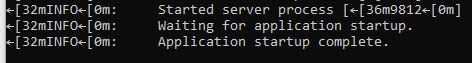
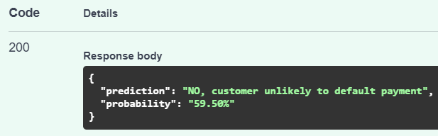

# Telco Default Classification
An attempt to predict whether a customer would default on telco payments based on his/her telco data with the company.


This repo contains:
- A notebook that **cleans a dataset** and **trains** a TabNet classification model
- Code to deploy TabNet model via an **FastAPI**
- Code to perform testing for API endpoint with `pytest` (not working)
- Code to delpy FastAPI on a Docker with a `Dockerfile`

## Dependencies / Prerequisites
These are the required libraries and frameworks to run the notebook and code.
```shell
pandas
numpy
matplotlib
torch
pytorch_tabnet
sklearn
```

## Part 1: Data Cleaning and Model Training
Please refer to [this link](https://github.com/Gamers-Blended/Telco_Default_Classification/blob/main/Technical_Test.ipynb) to read the process. <br>
The notebook contains steps and justification on the data cleaning process, model training and evaluation.

Model is based on:
- [GitHub link](https://github.com/dreamquark-ai/tabnet)
- [Paper](https://arxiv.org/pdf/1908.07442.pdf)


## Part 2: Deploying FastAPI Endpoint
1. Clone this repo
2. Open up the command prompt
3. Change the directory to the root of the cloned repo - the directory should contain `main.py` <br>
Eg:
`cd path\to\directory`
4. Run the following command in the command prompt to run FastAPI: <br>
`uvicorn main:app --reload` <br>
You should see this if it's successfully run: <br>

5. Open a web browser
6. Head to http://127.0.0.1:8000/docs
7. Under **POST**, click on "Try it out": <br>

8. In the **Request body** textbox, modify the values of the variables. <br>
These are the inputs the model will take to make a prediction. <br>
They have all been initialised as the int `0`. <br>

Information about the inputs:
```
	gender: int
	SeniorCitizen: int
	Partner: int
	Dependents: int
	tenure: float
	PhoneService: int
	MultipleLines: int
	OnlineSecurity: int
	OnlineBackup: int
	DeviceProtection: int
	TechSupport: int
	StreamingTV: int
	StreamingMovies: int
	PaperlessBilling: int
	MonthlyCharges: float
	TotalCharges: float
	InternetService_DSL: int
	InternetService_Fiber_optic: int
	InternetService_No: int
	Contract_Month_to_month: int
	Contract_One_year: int
	Contract_Two_year: int
	PaymentMethod_Bank_transfer_automatic: int
	PaymentMethod_Credit_card_automatic: int
	PaymentMethod_Electronic_check: int
	PaymentMethod_Mailed_check: int
```

Binary variables:
```
  gender: Female = 1, Male = 0
  SeniorCitizen: Yes = 1, No = 0
	Partner: Yes = 1, No = 0
	Dependents: Yes = 1, No = 0
  PhoneService: Yes = 1, No = 0
	MultipleLines: Yes = 1, No = 0
	OnlineSecurity: Yes = 1, No = 0
	OnlineBackup: Yes = 1, No = 0
	DeviceProtection: Yes = 1, No = 0
	TechSupport: Yes = 1, No = 0
	StreamingTV: Yes = 1, No = 0
	StreamingMovies: Yes = 1, No = 0
	PaperlessBilling: Yes = 1, No = 0
  InternetService_DSL: Yes = 1, No = 0
	InternetService_Fiber_optic: Yes = 1, No = 0
	InternetService_No: Yes = 1, No = 0
  
  These 3 variables are mutually exclusive:
	Contract_Month_to_month: Yes = 1, No = 0
	Contract_One_year: Yes = 1, No = 0
	Contract_Two_year: Yes = 1, No = 0
  
  These 4 variables are mutually exclusive:
	PaymentMethod_Bank_transfer_automatic: Yes = 1, No = 0
	PaymentMethod_Credit_card_automatic: Yes = 1, No = 0
	PaymentMethod_Electronic_check: Yes = 1, No = 0
	PaymentMethod_Mailed_check: Yes = 1, No = 0
```
Numerical variables:
```
tenure: float value to show how long has the customer has stayed with the telco company
MonthlyCharges: float value to show how much customer is being charged monthly
TotalCharges: float value to show total amount of charges
```
9. Once all inputs have been set, click on the "Execute" button
10. Under Responses, Server response, **Response body**, the model will output its prediction: <br>
If the model predicts customer will default: <br>
 <br>
If the model predicts customer will not default: <br>
 <br>

## Part 3: Testing FastAPI Endpoint (Not Working)
1. Check that current directory contains `test_main.py`. <br>
Else, change to the directory that contains both `main.py` and `test_main.py`.
2. Run the following command in the command prompt to test the endpoint: <br>
`pytest` <br>
If the model is deployed properly, the results should reflect a pass for all test cases. (unsucessful)


## Part 4: Deploying API on Docker
1. Open the command prompt
2. Check that the directory to the root of the cloned repo - the directory should contain `Dockerfile`
3. Ensure Docker is running on your local system
4. Run the following command in the command prompt to build the FastAPI image: <br>
`docker build -t myimage .` <br>
Note: `myimage` is the name of this image, it could be any name.
5. Once the image has been built, run a container based on the image by running the following command in the command prompt: <br>
`docker run -d --name mycontainer -p 80:80 myimage` <br>
Note: `mycontainer` is the name of the container, it also could be any name.
6. Open a web browser
7. Head to http://localhost/docs
8. Steps are identical to **Steps 7 to 10 in Part 2**

## Remarks
- Sadly, the model could predict with an accuracy rate of about **60%**. Its performance can be improved by hyperparameter tuning and/or feature engineering.
- Most of the features are not very corelated to whether a customer will default or not. It may be better to drop those variables.
- The dataset has a severe imbalance of class labels (73% of the customers did not default on payments). I could consider several methods in handling imbalanced classification such as using Synthetic Minority Oversampling Technique (SMOTE) to oversample the minority class (customers who defaulted).
- I am unsure of how to write code to perform testing of the API endpoint (part 3). There should be a test to:
   - check that the inputs follow the mutually exclusive characteristics of certain variables
   - check that binary variables are fed with only the int `0` or `1`, and numerical variables are given only numerical values
