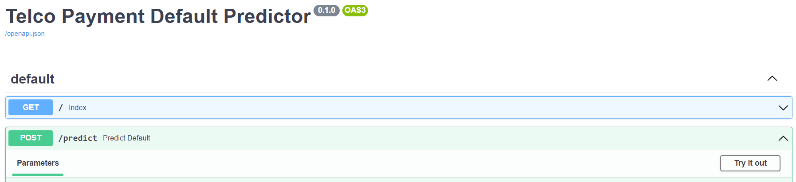
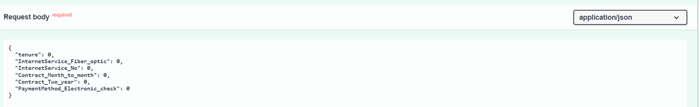

# Telco Default Classification
An attempt to predict whether a customer would default on telco payments based on his/her telco data with the company.


# Overview of Folder and Folder Structure
```
├── app
│ └── main.py
| └── Telco.py
| └── test_main.py
├── data
| └── finantier_data_technical_test_dataset.csv
├── ReadMe_Images
├── saved_items
│ └── classifier.pkl
| └── nn_model.h5
| └── scaler.pkl
├── Data_Processing_and_Modelling.ipynb
├── Dockerfile
├── requirements.txt
```

**app**
The `app` folder contains 3 files: `main.py`, `Telco.py` and `test_main.py`
`main.py` 
- This is code to deploy the model via FastAPI

`Telco.py` 
- Contains a BaseModel that would be used in `main.py`
- Lists all out input and dtypes

`test_main.py` 
- pytest code to test API endpoint

**data**
Contains dataset

**saved_items**
Contains saved TabNet(`classifier.pkl`) and Neural Network(`nn_model.h5`) models trained in `Data_Processing_and_Modelling.ipynb`, as well as the MinMaxScalar(`scaler.pkl`) used on the train set

**Data_Processing_and_Modelling.ipynb**
Notebook used to perform data cleaning model training and evaluation

**Dockerfile**
Used to build the Docker image

**requirements.txt**
Lists out required libraries to deploy model


## Dependencies / Prerequisites
These are the required libraries and frameworks to run the notebook and code.
```shell
pandas
numpy
matplotlib
seaborn
sklearn
torch
pytorch_tabnet
fastapi
pydantic
uvicorn
pytest
```

## Part 1: Data Cleaning and Model Training
Please refer to [this link](https://github.com/Gamers-Blended/Telco_Default_Classification/blob/main/Data_Processing_and_Modelling.ipynb) to read the process. <br>
The notebook contains steps and justification on the data cleaning process, model training and evaluation. <br>
The dataset is a tempered version of the [Kaggle Customer Churn dataset](https://www.kaggle.com/blastchar/telco-customer-churn). <br>
It contains data on customer's telco information.

Model is based on:
- [GitHub link](https://github.com/dreamquark-ai/tabnet)
- [Paper](https://arxiv.org/pdf/1908.07442.pdf)


## Part 2: Deploying FastAPI Endpoint
1. Clone this repo
2. Open up the command prompt
3. Change the directory to the root of the cloned repo - the directory should contain `main.py` <br>
Eg:
`cd path\to\directory`
4. Run the following command in the command prompt to run FastAPI: <br>
`uvicorn main:app --reload` <br>
You should see this if it's successfully run: <br>

5. Open a web browser
6. Head to http://127.0.0.1:8000/docs
7. Under **POST**, click on "Try it out": <br>

8. In the **Request body** textbox, modify the values of the variables. <br>
These are the inputs the model will take to make a prediction. <br>
They have all been initialised as the int `0`. <br>

Information about the inputs:
```
	tenure: int
	InternetService_Fiber_optic: int
	InternetService_No: int
	Contract_Month_to_month: int
	Contract_Two_year: int
	PaymentMethod_Electronic_check: int
```

Binary variables:
```
	InternetService_Fiber_optic: Yes = 1, No = 0
	InternetService_No: Yes = 1, No = 0
        PaymentMethod_Electronic_check: Yes = 1, No = 0
  
  These 2 variables are mutually exclusive:
	Contract_Month_to_month: Yes = 1, No = 0
	Contract_Two_year: Yes = 1, No = 0
  
```
Numerical variables:
```
tenure: int value to show how long has the customer has stayed with the telco company
```
9. Once all inputs have been set, click on the "Execute" button
10. Under Responses, Server response, **Response body**, the model will output its prediction: <br>
If the model predicts customer will default: <br>
 <br>
If the model predicts customer will not default: <br>
 <br>

## Part 3: Testing FastAPI Endpoint
1. Check that current directory contains `test_main.py`. <br>
Else, change to the directory that contains both `main.py` and `test_main.py`.
2. Run the following command in the command prompt to test the endpoint: <br>
`pytest` <be>
or
`pytest -W ignore::DeprecationWarning` to ignore `DeprecationWarning` <br>
If the model is deployed properly, the results should reflect a pass for all test cases. <br>
 <br>


## Part 4: Deploying API on Docker
1. Open the command prompt
2. Check that the directory to the root of the cloned repo - the directory should contain `Dockerfile`
3. Ensure Docker is running on your local system
4. Run the following command in the command prompt to build the FastAPI image: <br>
`docker build -t myimage .` <br>
Note: `myimage` is the name of this image, it could be any name.
5. Once the image has been built, run a container based on the image by running the following command in the command prompt: <br>
`docker run -d --name mycontainer -p 80:80 myimage` <br>
Note: `mycontainer` is the name of the container, it also could be any name.
6. Open a web browser
7. Head to http://localhost/docs
8. Steps are identical to **Steps 7 to 10 in Part 2**

## Remarks
- The model could predict with an accuracy rate of about **40%**. Possible actions to optimise model performance:
-  Use more of the provided features
- Tune the number of k in SelectKBest via GridSearch CV
-  Tune the parameters of the TabNet model via GridSearch CV or RandomSearchCV from sklearn.model_selection
- Try ensemble methods such as Random Forest Classifier, Gradient Boosting and XGBoost
Consider several methods in handling imbalanced classification such as using Synthetic Minority Oversampling Technique (SMOTE) to oversample the minority class (customers who defaulted)
- The dataset has a severe imbalance of class labels (73% of the customers did not default on payments). Consider some methods in handling imbalanced classification such as using Synthetic Minority Oversampling Technique (SMOTE) to oversample the minority class (customers who defaulted).
